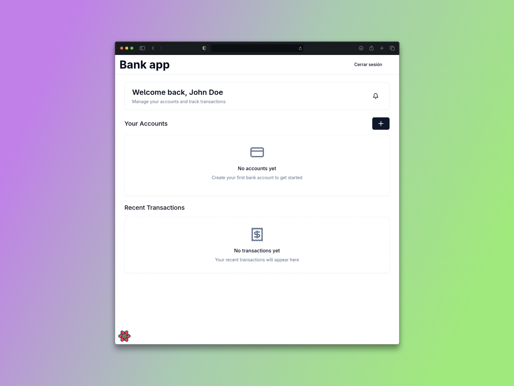
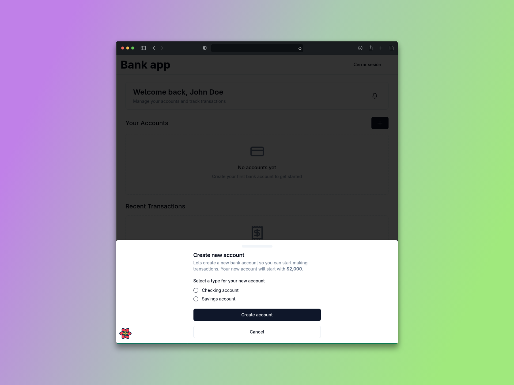
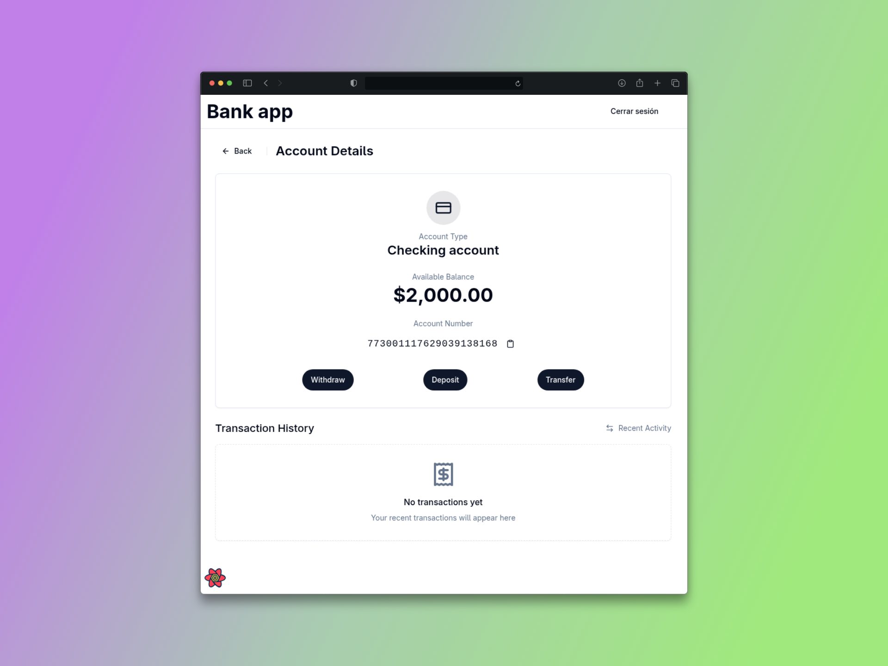
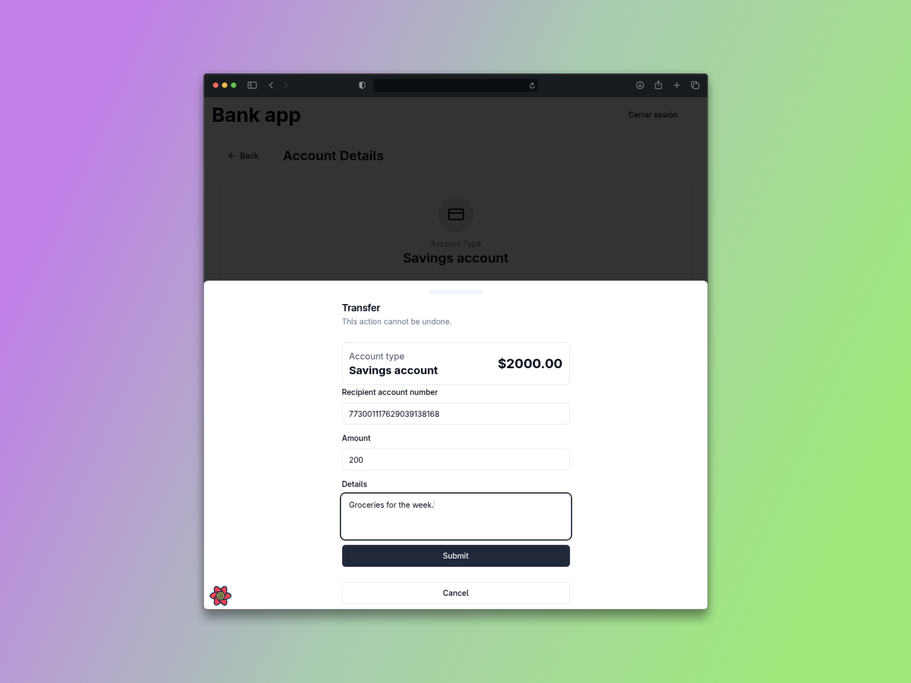
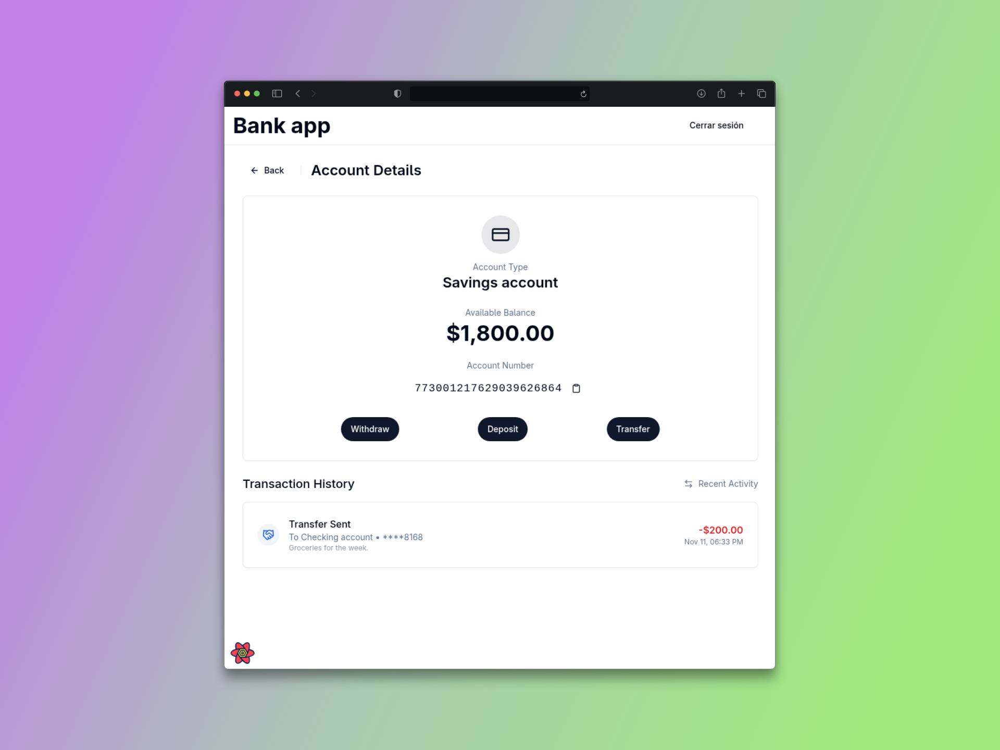

# Online Banking System

## Challenge Overview

Create an online banking system with the following features:

* Users must be able to log in with a username and password.
* If the user enters the wrong credentials three times, the system must lock them out.
* The initial balance in the bank account is $2000.
* The system must allow users to deposit, withdraw, view, and transfer money.
* The system must display a menu for users to perform transactions.

## Technology Stack

**Frontend:**
- React + TypeScript
- Vite (build tool)
- Tailwind CSS
- React Query

**Backend:**
- Node.js + Express
- PostgreSQL + Knex.js
- JWT Authentication
- Swagger (API documentation)
- Jest (testing framework)
- Supertest (HTTP assertions)

## Installation & Setup

### Prerequisites
- Node.js (v18+)
- PostgreSQL
- pnpm

### Project Setup

```bash
# Clone repository
git clone <repository-url>
cd online-banking-system

# Install dependencies
pnpm install

# Configure environment variables
cp .env.example .env
# Edit .env with your database credentials

# Install migration CLI
pnpm add -g knex

# Run database migrations
knex migrate:latest
```

## Running the Application

### Development
```bash
# Run everything (client + server)
pnpm dev

# Client only (port 5173)
pnpm --filter client dev

# Server only
pnpm --filter server dev
```

### Testing
```bash
# Run all server tests
pnpm --filter server test

# Run specific test file
cd apps/server && npm test -- auth.test.js

# Run transaction tests
cd apps/server && npm test -- transaction.test.js
```

### API Documentation
```bash
# Start the server and visit:
# http://localhost:3000/api-docs

# View API specification in JSON:
# http://localhost:3000/docs.json
```

### Production
```bash
# Build all packages
pnpm build

# Start production server
pnpm --filter server start
```

## Screenshots

### Login Page


### Sign Up


### Dashboard / Home


### Account Details


### Create Bank Account


### Transaction Form


### API Documentation (Swagger)
